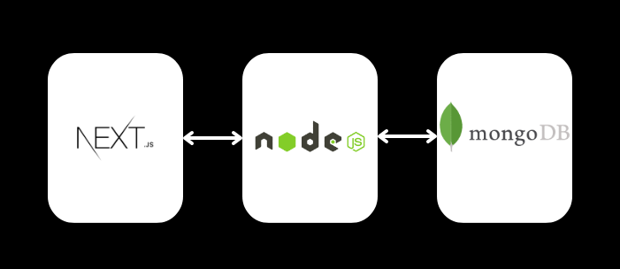
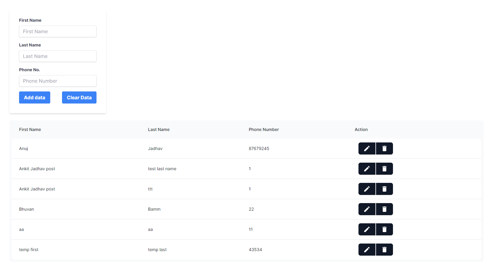
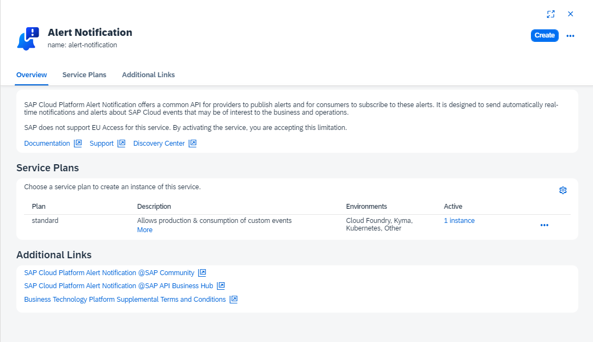
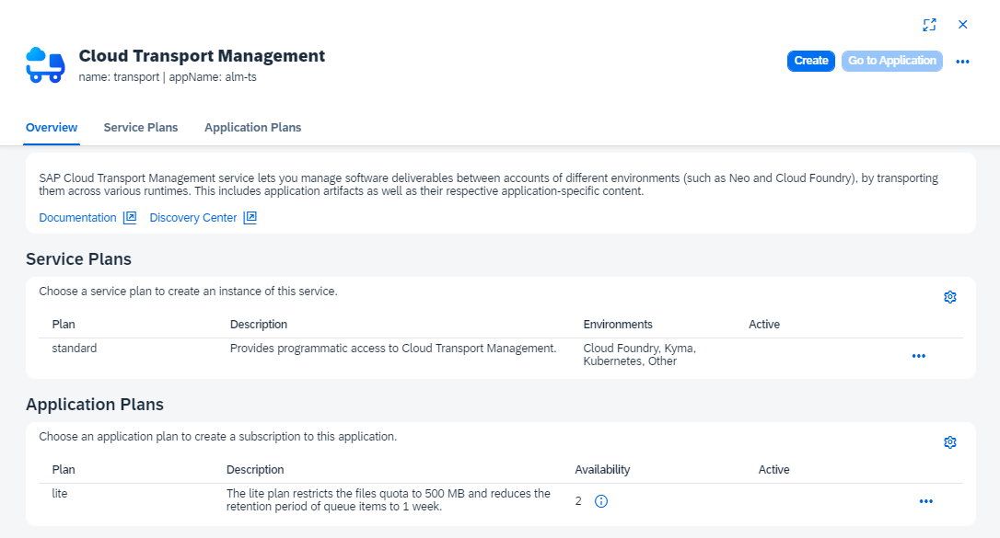
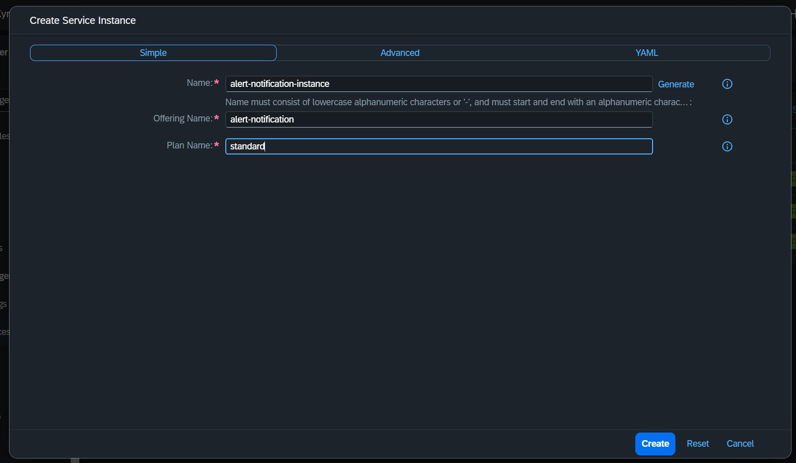
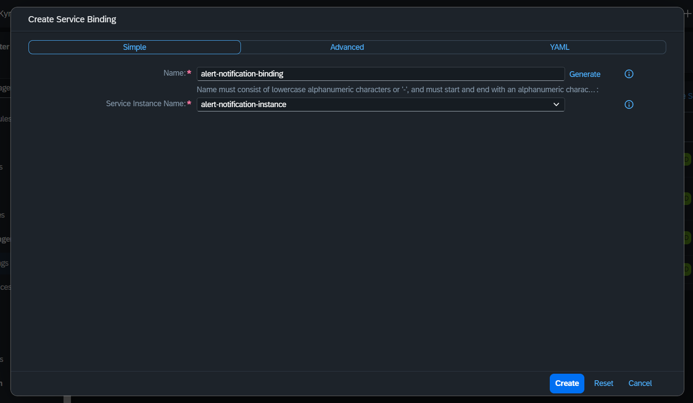
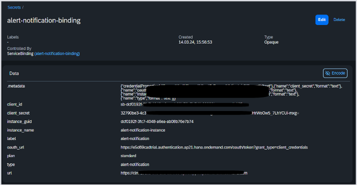

# POC on SAP BTP


## Prerequisite:
- 

## SAP BTP
- SAP BTP stands for SAP Business Technology Platform.
- It is an integrated platform-as-a-service offering from SAP.
- Allows businesses to build, extend, and integrate applications in the cloud.

## Kyma Environment VS CloudFoundary

| Aspect              | Kyma Environment                                                     | Cloud Foundry Environment                                          |
|---------------------|----------------------------------------------------------------------|--------------------------------------------------------------------|
| Architecture        | Microservices-oriented   (multiple loosely coupled services that communicate with each other through APIs)                                            | Application-centric (Monolithic)                                               |
| Docker Image        | Supports containerized microservices                                 | Supports containerized applications                               |
| How it Works        | Extends Kubernetes with additional components to enable seamless integration and extensibility, leveraging Istio for service mesh functionality (It helps to connect, secure, control, and observe microservices, providing features like traffic management, security, and telemetry) | Provides a platform for deploying and managing applications in a PaaS model, abstracting infrastructure complexities |
| Development Approach| Focused on cloud-native development practices, emphasizing microservices and API-first design | Supports traditional and cloud-native development approaches, with emphasis on simplicity and ease of deployment |


## Kyma Environment

- Microservices Focus: Kyma is designed with a microservices-oriented architecture, which offers flexibility and scalability for modern, distributed applications

## Creating a CRUD app in Kyma Environement



Application Details:
  - Frontend: Nextjs
  - Backend: Node.js
  - Database: MongoDB (Cloud)

DEMO: [UserInfo App - Frontend](https://crud-app-frontend.c-6826c17.kyma.ondemand.com/dashboard)

DEMO: [UserInfoApp - Backend](https://crud-app-backend.c-6826c17.kyma.ondemand.com/)

  

### Steps Involved:
1) Develop the app on your local
2) Create a docker image of your application   
3) Push the image to Docker Hub
4) Create deployment, service, api-rule correspoding to your application in Kyma Dashboard

Deployment: Making an application/service available by configuring and launching resources like containers, pods, and services in Kyma.

Service: Represents a microservice or application component, defining a set of pods and access policies for communication within Kyma.

API Rule: Exposes services securely to external entities, defining routing and access policies for incoming requests through well-defined APIs in Kyma.


E.g.

```
#  The container runs the "alert-app" service on port 3000 and uses the Docker image "anujjadhav0215/alert-app:latest"
apiVersion: apps/v1
kind: Deployment
metadata:
  name: alert-app
  labels:
    app: alert-app
spec:
  replicas: 1
  selector:
    matchLabels:
      app: alert-app
  template:
    metadata:
      labels:
        app: alert-app
    spec:
      containers:
        - name: alert-app
          image: anujjadhav0215/alert-app:latest
          imagePullPolicy: Always
          ports:
            - name: http
              containerPort: 3000
---
# This Service enables communication with Pods running the "alert-app" application within the Kubernetes cluster.
apiVersion: v1
kind: Service
metadata:
  name: alert-app
  labels:
    app: alert-app
spec:
  ports:
    - name: http
      port: 3000
  selector:
    app: alert-app
---
# this APIRule configuration defines rules for routing incoming requests to the "alert-app" service running on port 3000, using the Kyma gateway.
apiVersion: gateway.kyma-project.io/v1beta1
kind: APIRule
metadata:
  name: alert-app
spec:
  gateway: kyma-gateway.kyma-system.svc.cluster.local
  host: alert-app 
  service:
    name: alert-app
    port: 3000
  rules:
    - path: /.*
      accessStrategies:
        - config: {}
          handler: noop
      methods:
        - GET
        - POST
        - PUT
        - DELETE
```

### Development time

It does not depend on whether we are using sap or not, as our application itself is opensource and we are using SAP only for deployment purposes in this case. (We haven't used any service here.)

## Using a Service in Kyma Environment

You can see the list of services available in the SAP BTP Cockpit > Service Marketplace

or 

You can use: Service Manager Control (SMCTL) Command-Line Tool

```
$ smctl marketplace
```
17 service offerings.

| Name | Plans | Description | BROKER ID |
| ----------------------- |  ---------------------------------------------------------------------- |  ------------------------------------------------------------------------------------------------------------ |  ------------------------------------ |  
| destination             | lite                                                                   | Provides a secure and reliable access to destination and certificate configurations                          | c3a6a2c3-6c0c-4c27-af9f-a2519773dc4a  |
| feature-flags           | lite                                                                   | Feature Flags service for controlling feature rollout                                                        | 6e29022c-d132-456b-8fa5-a3520b0fa171  |
| cis                     | central, local                                                         | Manage the control plane, account model, and product resources in SAP BTP using supported API interfaces.    | dc08771c-756a-44a6-b87a-acadc61b7557  |
| html5-apps-repo         | app-host, app-runtime                                                  | Enables storage of HTML5 applications and provides runtime environment for HTML5 applications.               | f405e780-37fd-4650-9862-5de12353477c  |
| saas-registry           | application                                                            | Service for application providers to register multitenant applications and services                          | f195188e-fbd3-420a-b5b2-9a6bf66b6ec3  |
| service-manager         | subaccount-admin, subaccount-audit, container, service-operator-access | The central registry for service brokers and platforms in SAP Business Technology Platform                   | 99bd33af-5089-45f3-87eb-884861e5e9ca  |
| xsuaa                   | broker, application                                                    | Manage application authorizations and trust to identity providers.                                           | 39fd33ff-ac1a-4ea2-91a2-455ac5d713d7  |
| auditlog-management     | default                                                                | Retrieve logs and change retention                                                                           | 5a08077d-cfc1-46c5-81f7-caf854dda351  |
| connectivity            | connectivity_proxy                                                     | Establishes a secure and reliable connectivity between cloud applications and on-premise systems.            | 9efaad2d-4ebf-4d87-83f4-3168d734b3f9  |
| ui5-flexibility-keyuser | trial                                                                  | Add UI adaptation to your UI5 applications.                                                                  | a42ae6fc-517c-4bd0-a711-c4873acc5d49  |
| transport               | standard                                                               | Provides programmatic access to Cloud Transport Management.                                                  | 2d4ba502-996c-4fb4-806a-da70d6453050  |
| alert-notification      | standard                                                               | Service that exposes platform events and offers APIs for producing/consuming custom events                   | d700526f-3ab1-4c4e-a6d7-4c4424dc8ae7  |
| credstore               | proxy, trial                                                           | Secure repository for credentials, cryptographic keys and certificates.                                      | 8110adfa-f2d5-40a2-9fc2-555c5ca8b5df  |
| content-agent           | standard, application                                                  | Content Agent allows you to assemble the content into MTAR and export it to the transport queue.             | 2321af7d-d299-4ef5-a157-1c1ce37c441c  |
| uas                     | reporting-ga-admin                                                     | Collect and analyze usage information for analysis, reporting, cost, and auditing.                           | bff0ed7c-6b14-4858-a25b-aa2a7ca58553  |
| identity                | application                                                            | Cloud Identity Services                                                                                      | eb3e1a10-b98b-4a6b-af4d-cdcc9d5a265a  |
| abap-trial              | shared                                                                 | Access a shared instance to build custom ABAP cloud apps, leveraging newest innovations powered by SAP HANA. | 2ff8bef3-d1b0-443f-a94a-9dfb8b87de05  |

### Plans

The plans are different for different services, you need to go through the description before using the best one for you. Standard plan for one service may not be similar to standard plan of another service




## Steps:

- Create a service instance [link](https://dashboard.kyma.cloud.sap/cluster/garden-kyma--c-6826c17-external/namespaces/poc/serviceinstances).

  It provides access to the functionality and resources offered by the service.

NOTE: You can only create one instance of the service

- Create a service binding [link](https://dashboard.kyma.cloud.sap/cluster/garden-kyma--c-6826c17-external/namespaces/poc/servicebindings)

  Associates a service instance with an application, allowing the application to access and utilize the services provided by the instance.

NOTE: You can create multiple bindings for the same instance


- Through service bindings we get the credentials through which we can consume the service.


### Example app using Alert Notification Service:

[Documentation of alert notification app] (https://sap.github.io/alert-notification-node-client/)

Demo: [Alert Notification App](https://alert-app-frontend.c-6826c17.kyma.ondemand.com/)

Application Details:
  - Frontend: HTML/CSS/JS
  - Backend: Node.js
  - Used npm package: `@sap_oss/alert-notification-client` provided by SAP
  - Binding gives us these details:
    - client_id
    - client_secret
    - oauth_url
    - url
  - Using these credentials we can do `OAuthOAuthAuthentication` and create a `AlertNotificationClient`
    ```js
    const client = new AlertNotificationClient({
        authentication: new OAuthAuthentication({
            username: "<client_id>",
            password: "<client_secret>",
            oAuthTokenUrl: "<oauth_url>"
        }),
        region: RegionUtils.AP21
    });
    ```
  - Using this client we can create `Actions` and `SendEvents`
    ```js
    // Create Actions:
    const action = {
        name: 'to-email',
        type: 'EMAIL',
        description: 'send to my mail',
        state: State.ENABLED,
        properties: {
            destination: 'anujjadhav0215@gmail.com'
        }
    }

    client.create(EntityType.ACTION, action)
    .then(action => {
        client.get(EntityType.ACTION, action.name)
            .then(action => console.log(action)) // Action you have created
            .catch(error => console.log(error));
    })
    .catch(error => console.log(error)); // Shouldn't happen if everything above is setup correctly
    ```
    ```js
        // Import configuration
        await client.importConfiguration({
            actions: [
                {
                    name: 'to-email',
                    type: 'EMAIL',
                    description: 'send to my mail',
                    state: State.ENABLED,
                    properties: {
                        destination: 'anujjadhav0215@gmail.com'
                    }
                }
            ],
            conditions: [
                {
                    name: 'event-type-contains-HighCpu',
                    description: 'Match events which body contains HighCpu',
                    propertyKey: 'eventType',
                    predicate: Predicate.CONTAINS,
                    propertyValue: 'HighCpu'
                }
            ],
            subscriptions: [
                {
                    name: 'event-with-eventType-HighCpu-to-mail',
                    state: State.ENABLED,
                    actions: ['to-email'],
                    conditions: ['event-type-contains-HighCpu'],
                    description: 'Subscription will act when an event with eventType - HighCpu is received and will send an email to me'
                }
            ]
        });

        // Send event
        const event = await client.sendEvent({
            body: "",
            subject: "",
            eventType: "",
            severity: "",
            category: "",
            resource: {
                resourceName: "",
                resourceType: "",
                resourceInstance: "",
                tags: {
                    detailsLink: "",
                }
            },
            eventTimestamp: "",
            priority: "",
        }); 
    ```

  - Action: Action is an entity which represents the destination on which Alert Notification service will send a processed event, e.g. Email, Slack, Webhook, etc.
  - Condition: Condition is an entity which defines a condition in the context of the Alert Notification service which must be met in order for some Action to be triggered
  - Subscription is the aggregation of actions and conditions. When an event is received in Alert Notification service, it will only be processed if a subscription exists and the matching criteria of the conditions are fulfilled.

## Problems:
- For deploying the application we need to create Docker image of that application, but docker is blocked by TI
- CLI tools like kubectl, smctl, oidc_login are required, but without `admin` access we cannot install them using powershell.
- SAP provides tutorials, but they are hard to follow due to poor documentation and some missing steps.
- Lack of documentation on how to consume services. 
- Trial account Kyma env automatically disables after 14 days, so all the development is lost and we need to start again from scratch.